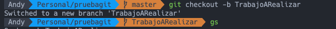
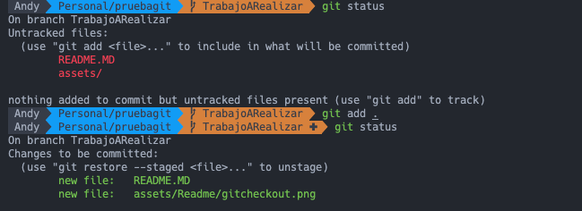
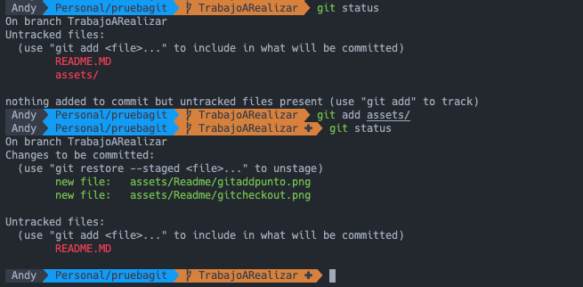
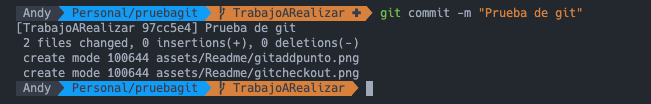
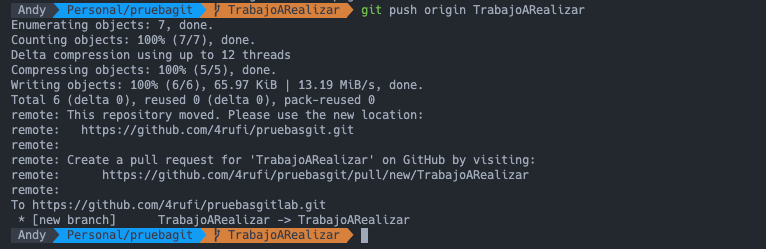
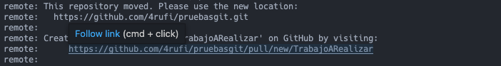
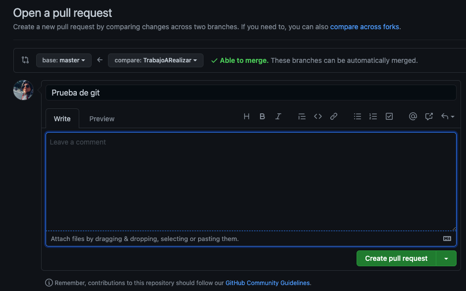
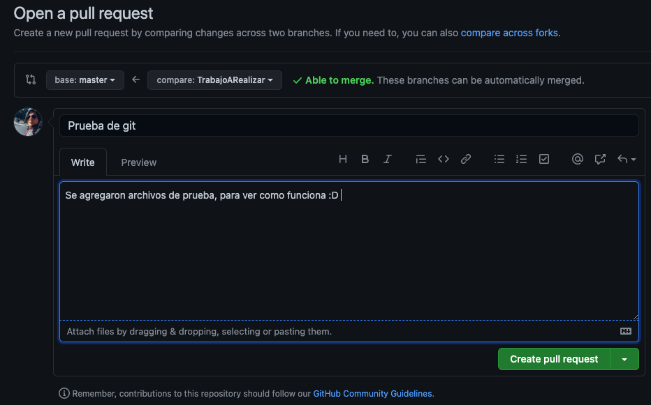
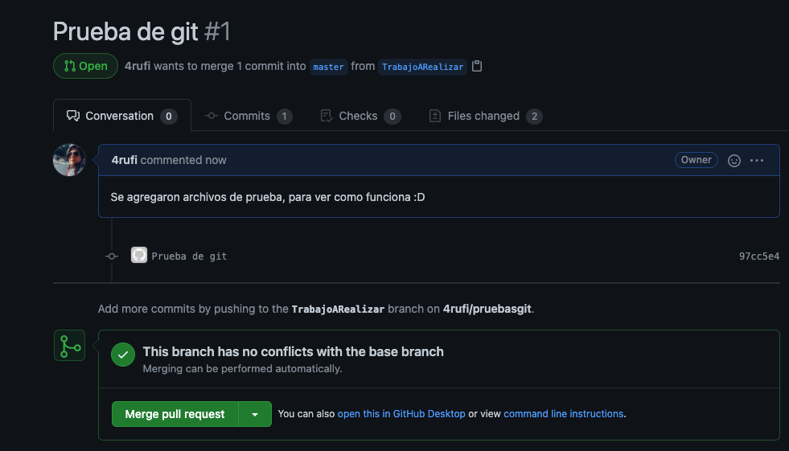

# Pruebas GIT

Este será un tutorial para que puedan usar git de forma rápida :D

Primero que nada deben establecer una base en donde trabajar. en este caso será solo el archivo index.html.

## Primeros pasos

1. Lo primero será clonar el repositorio
   ` git clone https://github.com/4rufi/pruebasgit.git`
2. Deben abrir la carpeta en vscode o su editor favorito.

## Creando una nueva rama

Para trabajar en conjunto es necesario que se creen nuevas ramas a partir de la rama principal (en este caso master).

1. Creando nuestra rama, el nombre de la rama puede ser cualquier cosa, la idea es saber en que se trabajará
   `git checkout -b "TrabajoARealizar"`
   Al momento de realizar este comando los posiciona en la nueva rama.

## Trabajando en mi nueva rama

Para realizar esto, es tal como lo estan trabajando actualmente. solo que cuando suban los cambios existe un cambio.

## Subiendo los cambios

Para subir los cambios deben seguir los siguientes pasos:

### Git Add

1. agregar los datos que subiran, para esto existen 2 formas rapidas.

- Si necesitan subir todo lo que hicieron.
  `git add .`
  
- Si necesitan subir un archivo especifico
  `git add ruta/archivo `
  
  al hacer un `git status ` pueden revisar todos los cambios que se subieron

### Git commit

2. Para subir los cambios deben realizar un
   `git commit -m "Mensaje con que fue lo que hicieron" `
   

### Git push

3. Deben subir su código con el nombre de la rama que crearon en pasos anteriores, para este caso la rama se llama `TrabajoARealizar`
   `git push origin TrabajoARealizar`
   

### Juntando las ramas :D

4. Para poder juntar la rama deben hacer un pull request, pero cuando hicieron el paso anterior les dejo una dirección
   
   si van a esa url les mostrará lo siguiente:
   

#### Descripción de los datos solicitados:

**base**: Se refiere cual es su rama maestra, en este caso es la rama master en donde se juntará todo.
**compare**: Es cual es la rama en la que tiene todos mis cambios.
**write**: una pequeña descripción de lo que se esta haciendo y se tiene que revisar.

Agregamos los datos y le damos a Create pull request

Si todo salio bien nos mostrará lo siguiente:

le pedimos a la otra persona que revise los cambios y presione Merge Pull pullRequest, en este caso lo presionaré yo mismo, el resultado es que se mezclaron mis cambios con la rama master

## Descargando los cambios de la rama

para poder descargar los cambios se debe realizar lo siguiente:

`git pull origin TrabajoARealizar `
